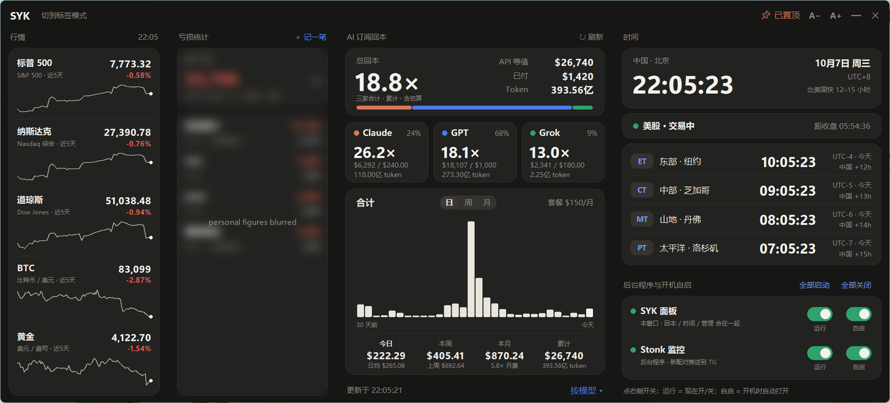

# syk-desktop-panel

A small always-on-top desktop panel for Windows, written in plain Python (tkinter + Pillow). It puts the few numbers I look at all day into one borderless dark window.

一个 Windows 桌面常驻小面板，纯 Python（tkinter + Pillow）。把每天要看的几样东西放进一个无边框的深色窗口。



## What it shows

| Column | File | What it does |
|---|---|---|
| Markets | `market_widget.py` | S&P 500, Nasdaq, Dow, BTC and gold with a 5-day sparkline. Yahoo Finance chart API, refreshed every 60 s. |
| Loss ledger | `loss_widget.py` | Running total and per-project breakdown, read from a local HTTP API. Entries can be added from the panel. |
| AI subscription payback | `tokpay_widget.py` | How much API-equivalent usage you got out of flat-rate AI subscriptions, by vendor, by day / week / month. |
| Clock | `clock_widget.py` | Beijing time, four US time zones, and whether the US market is pre-market / open / after-hours / closed. |
| Helpers | `hub.py` | Start / stop background scripts and toggle run-at-login. |

`panel.py` is the shell that hosts the columns, aligns them to one grid, and handles zoom, pin-on-top and minimise-to-corner.

## Run

```
pip install pillow requests psutil
pythonw panel.py
```

Windows only (uses DWM rounded corners, the Startup folder and `pythonw`).

## Configuration

- Copy `config.example.json` to `config.json` and put your own subscription prices in `history` (`["YYYY-MM", monthly_usd]` per vendor). The numbers in the example are placeholders.
- `SYK_PROXY` — HTTP proxy used for Yahoo Finance. Defaults to `http://127.0.0.1:7890`; set it to an empty string to connect directly.
- `SYK_ZOOM` — UI scale, also adjustable with `A− / A+` or Ctrl + mouse wheel.
- The loss column expects a local service at `http://127.0.0.1:8888/api/loss-ledger`. Without it the column just shows that it cannot read the ledger.
- The payback column reads local usage logs of Claude Code and Codex, and optionally Hermes inside WSL (`hermes_source.py`). It only reads token counts, never conversation content.

`config.json`, `cache.json` and `panel_config.json` hold personal data and window positions; they are git-ignored.

## Notes on the drawing

Cards are drawn with Pillow at 3× and downsampled, then placed on a tkinter canvas, so rounded corners and thin lines stay smooth on high-DPI screens. Backgrounds are painted once; only the text items are updated on each tick.

## License

MIT
